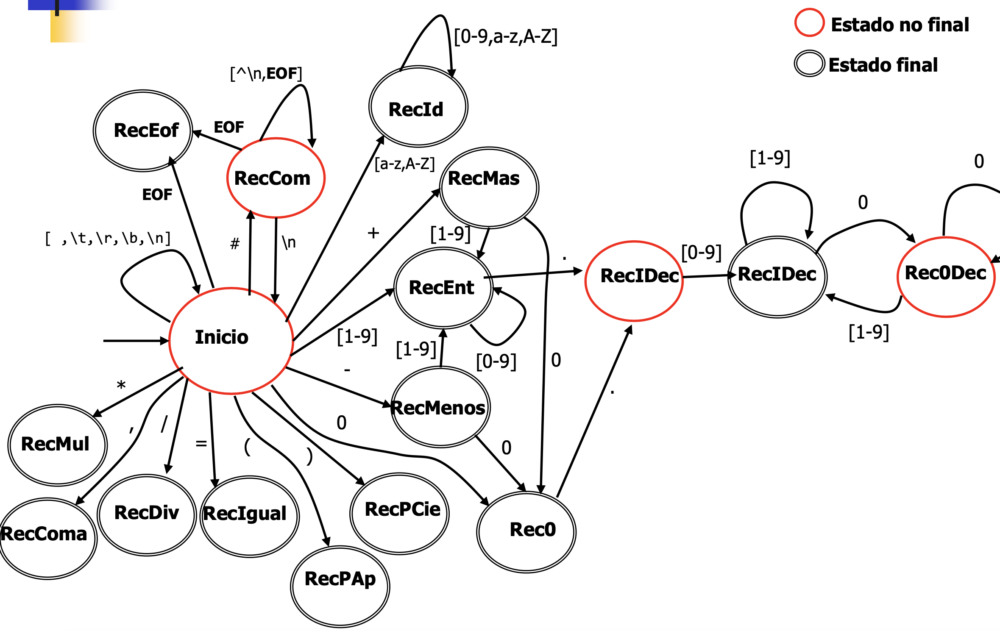
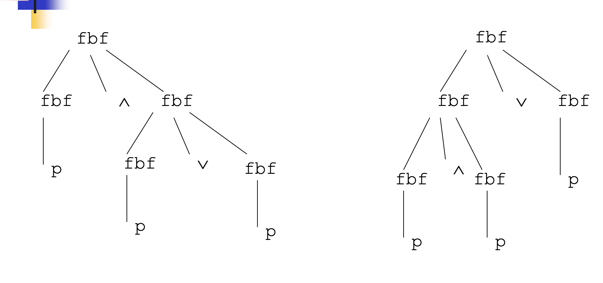
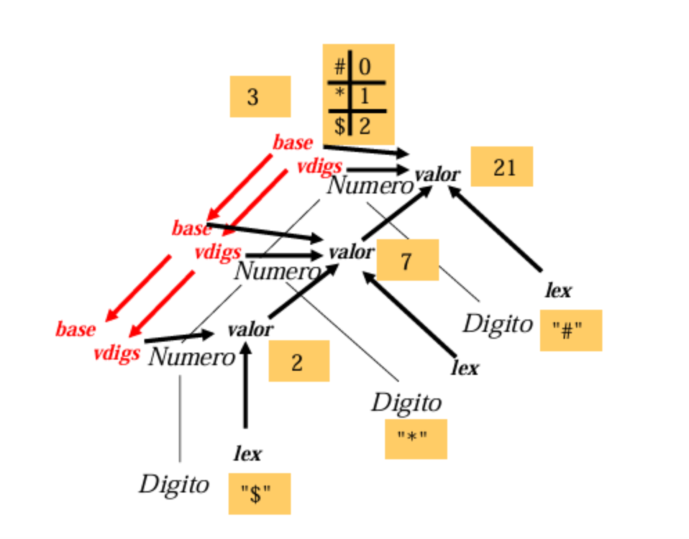
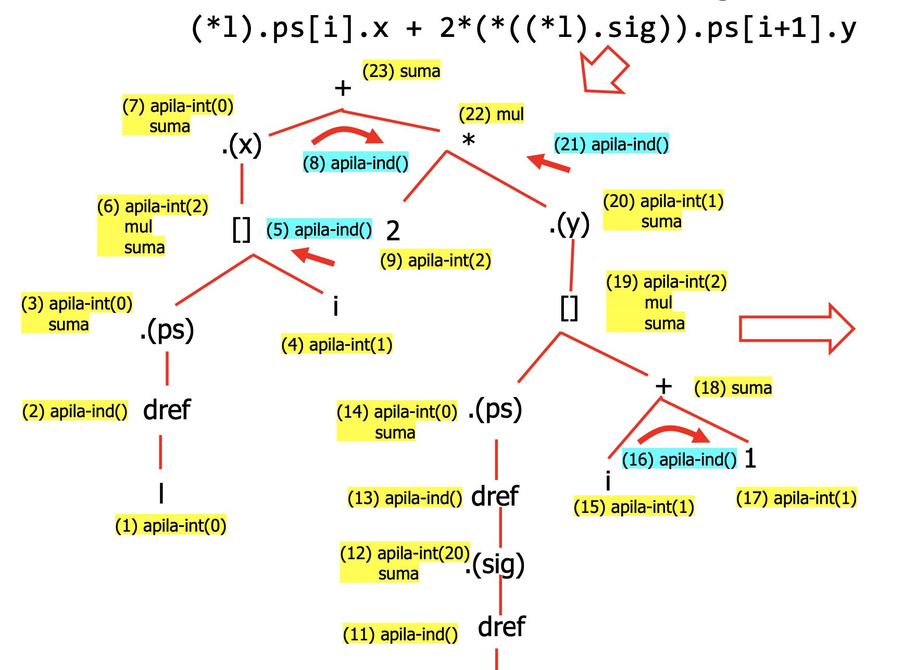

# Tiny Language Compiler
    A language interpreter to translate a modern c-like language to lower-level executable machine code. The first three parts were made with my teamates and the last part was done on my own.

## PR1: Scanner

- The scanner works like a tokenizer. It reads from the StringIO and try to identity all the tokens
- The reserved words are treated the same as identifier at this stage. 
- The implemented use a greedy way to detect and prioritize the longest possible tokens

- There are two scanners:
    - The `tiny language scanner` is built without any generator tools and is a subset of the `language scanner`
    - The `language scanner` is implemented with [JFlex](https://jflex.de/)
- [PR1 sepcification](./PR1/memoria_lexico.pdf)

## PR2: Parser

- Based on the tokens, the parser analyzes the syntax of the tokens using syntatcic grammar rules.
- There are in general two ways to analyze the syntax
    - bottom-up (e.g. LALR used by [CUP](https://www.cs.princeton.edu/~appel/modern/java/CUP/))
    - top-down (e.g. LL(K) used by [JavaCC](https://javacc.github.io/javacc/))
- The javacc solution implemented here is LL(1)
- When implementing LL(1), we need to rewrite some grammar rules to avoid recursing to the left and shared element in the following set
- [PR2 sepcification](./PR2/Memoria%20práctica%202.pdf)

## PR3: Creating Abstract Syntax Tree (AST)

- AST is an abstraction of the trees buit by syntatic rules
- Non-terminals of no semantic meaning are left out of the AST
- [PR3 sepcification](./PR3/Memoria%20AST.pdf)

## PR4: Processing

- There are 5 phases of processing: Linking, Type checking, space assignment, line labeling, code generation
- In each phase, we iterate through the constructed AST (and decorate the node).
- Linking is the process to deal with variables. 
    - When declaring a variable or type, we store it in a dictionary, and when using an identifier, we look for its declartion in that dictionary and link it to that declaration
    - The dictionary is nested because we have to take care of the scope. When looking the declaration of a variable, we first check its current dictionary. If it does not exsit, we go up and check the parent dictionary
    - During the linking phase we iterate through the AST twice because the grammar allows for referencing ahead to a type that is not yet defined and self-referencing.

- Type checking is the process to assign a type to each variable node.
    - When processing an identifier, we go to its declaration and assign the type according to the declaration
    - We also check if all the variables conforms to the semantic rules. Certain constructor has requirements for the type of the variable. For example, the operands of "+" can only be integer or decimals. 

- Space assignment is the process to assign the size and address to each variable
    - Variables in different scopes may have the same local address (displacement) since they will not affect each other
    - We also need to process the AST twice because the size of a variable referenced by the pointer cannot be determined in advance.

- Line labeling is the process to assign a line number to each node
    - These line numbers can be determined by counting the lines of machine code

- Code generation is the process to generate machine code
    - Each constructor can be seen as a function, and we need the machine code to implement the function
    - We use the line numbers from the last phase to easily implement jumps for the control flows
- [PR4 sepcification](./PR4/Memoría%20Fase%204.pdf)
